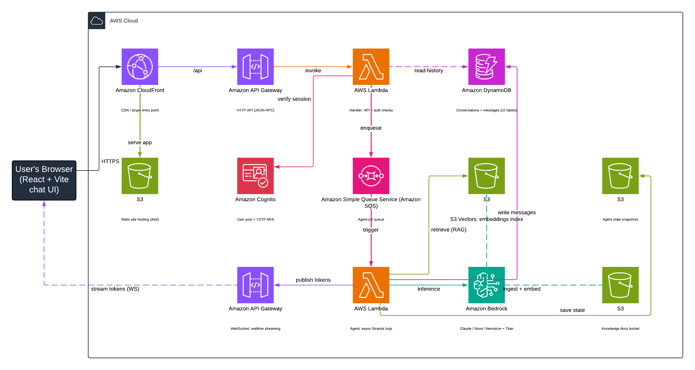

# Ask My Handover Docs

A RAG (retrieval-augmented generation) chat agent that answers questions about a set of
team handover documents, so colleagues can self-serve while the document owner is away.
Ask a question → the agent searches the docs → Claude (or Nova / Nemotron) answers using
only what the passages say, and cites the source.

Built on **AWS Blocks** (see below), so the exact same code runs locally with no AWS
account and deploys to a full serverless stack unchanged.

## What is AWS Blocks?

**AWS Blocks** is an open-source TypeScript framework where each *Block* bundles three
things together: the application code, a local implementation you can run offline, and the
AWS infrastructure needed to run it in the cloud.

You don't write CloudFormation, CDK stacks, or Terraform by hand. Instead you write
plain TypeScript in `aws-blocks/index.ts` — you *instantiate Blocks* (an `AuthCognito`, a
`KnowledgeBase`, an `Agent`, and so on) — and the infrastructure is **derived from that
code**. AWS calls this pattern **Infrastructure from Code**: the code is the source of
truth, and the cloud resources are generated to match it, rather than being described
separately in a config language.

The headline benefit is that **the same code runs in two places with zero changes**:

- **Locally** — no AWS account required. Blocks provide in-process mocks (e.g. TF-IDF
  search instead of Titan embeddings, Ollama instead of Bedrock), so you can develop and
  test the whole app on `localhost`.
- **Deployed** — the same Blocks provision and run on real AWS: Lambda, DynamoDB, API
  Gateway, Cognito, S3, SQS, and more.

AWS's own announcement pitches this as removing "the need to learn infrastructure tools":
the idea is that an app developer can ship a production cloud backend without first
mastering each underlying AWS service — you only go deeper into a given service if and
when you choose to. For someone whose strength is application code rather than infra
plumbing, that is the whole appeal.

> **How it maps here:** the four Blocks in `aws-blocks/index.ts` — `AuthCognito`,
> `KnowledgeBase`, and three `Agent` blocks (one per selectable model) — are what generate
> this app's entire serverless backend. See the architecture diagram for the resources
> they expand into.

**Reference:** official AWS Blocks repository —
[github.com/aws-devtools-labs/aws-blocks](https://github.com/aws-devtools-labs/aws-blocks)

## Architecture



Request path: Browser → CloudFront → API Gateway (HTTP) → Handler Lambda (Cognito auth) →
SQS → Agent Lambda → Bedrock + S3 Vectors (RAG) → tokens streamed back over the
API Gateway WebSocket. DynamoDB stores conversations/messages; S3 holds the static site,
knowledge docs, embeddings index, and agent state snapshots.

## Getting Started

```bash
npm run dev          # Backend (local mocks) + React frontend, concurrently
npm run test:e2e     # Run the e2e tests against the typed client
npm run sandbox      # Deploy the backend to an AWS sandbox, serve frontend locally
```

Open http://localhost:5173 after `npm run dev`. Sign-in uses admin-created Cognito users
with TOTP MFA; local dev captures the verification codes in-process (no real email/SMS).

## Project Structure

| Path | Purpose |
|------|---------|
| `aws-blocks/index.ts` | Backend: auth, knowledge base, agents, and the JSON-RPC API |
| `aws-blocks/index.cdk.ts` | The CDK stack Blocks derives (adds `Hosting` on deploy) |
| `src/App.tsx` | Frontend: React chat UI with live token streaming |
| `src/main.tsx` | React entry point |
| `knowledge/` | The source documents the agent indexes and answers from |
| `test/e2e.test.ts` | Tests: auth, conversations, retrieval, ownership |
| `docs/` | Exercise write-up, glossary, RAG + Cognito deep-dives |

## What's Included

- **AuthCognito** — email sign-in, TOTP MFA required, admin-created users only (no public
  sign-up). Sessions and the user pool are retained on stack deletion.
- **KnowledgeBase** — indexes `./knowledge`: chunk → embed → store. Local dev uses TF-IDF
  (free, no Bedrock); on AWS it embeds with Titan v2 and stores vectors in S3 Vectors.
- **Agent (×3)** — one `Agent` block per selectable model (Claude Sonnet 4.6, Amazon Nova
  Pro, Nvidia Nemotron), each with a `searchDocs` tool that calls `kb.retrieve()`. The
  model answers only from the retrieved passages and cites the source.
- **Realtime streaming** — the agent runs async (SQS → background Lambda) and publishes
  token chunks to an API Gateway WebSocket channel, so answers stream into the UI live.

## Commands

| Command | Description |
|---------|-------------|
| `npm run dev` | Backend + React dev server (concurrent) |
| `npm run test:e2e` | Test the API via direct imports (same typed client as the frontend) |
| `npm run typecheck` | TypeScript type checking |
| `npm run sandbox` | Deploy backend to AWS, serve frontend locally |
| `npm run deploy` | Full production deploy (adds CloudFront/S3 hosting) |

## For Agents

Full Building Block documentation: `node_modules/@aws-blocks/blocks/README.md`

**Do not use local files or in-memory storage** — use Building Blocks for all data
persistence and cloud abstractions (they mock locally and deploy to AWS automatically).

Start in `aws-blocks/index.ts` (backend) and `src/App.tsx` (frontend). Test via
`npm run test:e2e`. The API transport (JSON-RPC) is auto-generated and intentionally
invisible — do not curl endpoints directly. Testing is best done through the e2e tests,
which use the same typed client as the frontend.
