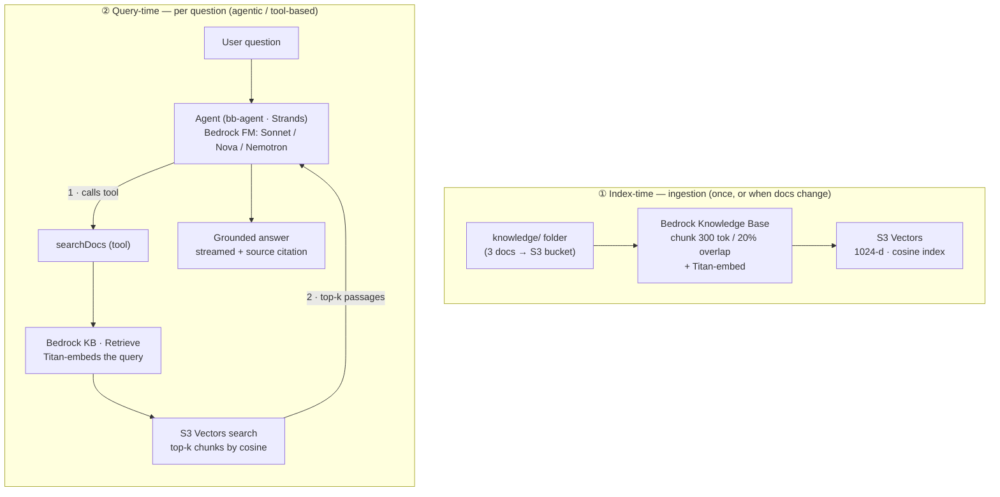

# How RAG is implemented in this exercise

A reference walkthrough of the retrieval-augmented generation (RAG) architecture
behind "Ask my handover docs" — what runs where, which AWS services back it, and why.

For term definitions see the [Glossary](./glossary.md). For the *story* of why the
app pivoted to RAG (and the local-vs-cloud gotchas encountered), see
[§6 of the exercise wiki](./exercise-wiki.md#6-the-rag-pivot--ask-my-handover-docs).

---

## TL;DR

It's **agentic RAG on a managed AWS service**. Amazon **Bedrock Knowledge Bases**
does the retrieval work (chunk → embed → store → search); the **LLM decides when to
retrieve** by calling a `searchDocs` tool. Vectors live in **Amazon S3 Vectors**,
embeddings come from **Amazon Titan Text Embeddings V2**, and the answer is written
by a Bedrock chat model (Claude Sonnet 4.6 / Nova Pro / Nemotron). Local dev swaps
the whole retrieval engine for in-memory **TF-IDF** so it needs no AWS and no cost.

---

## The two Building Blocks that compose it

RAG here is just two AWS Blocks wired together in `aws-blocks/index.ts`:

1. **`KnowledgeBase` block** (`index.ts:48`) — points at the `./knowledge` folder.
   Owns ingestion + the `retrieve()` API.
2. **`Agent` block** (`index.ts:104`) with a **`searchDocs` tool** (`index.ts:112`)
   whose handler is one line: `kb.retrieve(query)` (`index.ts:123`).

The system prompt (`index.ts:109`) enforces the discipline that makes RAG trustworthy:
search first, answer only from retrieved passages, cite the source file, otherwise
say it's not in the docs.

```ts
// aws-blocks/index.ts (abridged)
const kb = new KnowledgeBase(scope, 'docs', { source: './knowledge', removalPolicy: 'destroy' });

// ...inside the agent's tools:
searchDocs: tool({
  // ...
  handler: async ({ input }) => {
    const results = await kb.retrieve(input.query, { maxResults: input.maxResults ?? 5 });
    return results.map((r) => ({ text: r.text, source: r.source, score: r.score }));
  },
}),
```

> **Type gotcha:** the handler maps to a plain `{ text, source, score }` shape
> because tool results must be `JSONValue`. See
> [§6](./exercise-wiki.md#type-gotcha-tool-results-must-be-jsonvalue).

---

## Evidence — how we know it's Amazon Bedrock Knowledge Bases

This is the **managed** [Amazon Bedrock Knowledge Bases](https://docs.aws.amazon.com/bedrock/latest/userguide/knowledge-base.html)
service — not a lookalike or a hand-rolled retrieval pipeline. "Managed" means
Bedrock owns the whole RAG pipeline: you hand it documents in S3 and it does the
chunking, Titan embedding, vector writes, and semantic retrieval. The app never runs
an embedding loop or a vector query itself — it just calls `kb.retrieve()`, which is
one `RetrieveCommand`. It's provisioned as code (CDK L1 `Cfn*` constructs) rather
than console click-ops, but the runtime behaviour is identical to that doc.

The proof is in the block's provisioning + runtime code:

| What it proves | Code |
|---|---|
| The KB resource itself | `bedrock.CfnKnowledgeBase` — `bb-knowledge-base/dist/index.cdk.js:287` |
| Managed data source (S3 → KB) | `bedrock.CfnDataSource` — `index.cdk.js:318` |
| Vector store backend | `storageConfiguration.type = 'S3_VECTORS'` — `index.cdk.js:303-305` |
| Embedding model | Amazon Titan Text Embeddings V2 in `vectorKnowledgeBaseConfiguration` — `index.cdk.js:291-293` |
| Managed retrieval API | `RetrieveCommand` from `@aws-sdk/client-bedrock-agent-runtime` — `index.aws.js:255` |
| Managed ingestion API | `StartIngestionJob` / `GetIngestionJob` from `@aws-sdk/client-bedrock-agent` — `index.aws.js`, `index.cdk.js:362` |

The one decision *not* covered by that AWS doc page is the **vector store choice**
(S3 Vectors vs OpenSearch Serverless / Aurora / Pinecone) — a configurable option
*within* the same service. See
[Why S3 Vectors](#why-s3-vectors-over-opensearch-serverless).

---

## Architecture



### ① Index-time (ingestion)
Runs once on deploy, and again whenever the docs change:

1. Documents in `knowledge/` are uploaded to an **S3** bucket.
2. **Bedrock Knowledge Bases** runs an ingestion job: it parses each file (incl.
   PDFs/Office docs on the cloud path), splits it into **300-token chunks with 20%
   overlap** (`FIXED_SIZE`), and embeds each chunk with **Titan Text Embeddings V2**.
3. The resulting 1024-dimension vectors are written to the **S3 Vectors** index
   (cosine distance).

Ingestion is **asynchronous** — `retrieve()` returns empty for the first few minutes
after deploy until the job finishes. Poll `kb.isSynced()` / `kb.waitUntilSynced()`.

### ② Query-time (per question)
This is the **agentic loop** — nothing retrieves until the model decides to:

1. The user's question goes to the **Agent** (a Bedrock chat model driven by the
   Strands SDK).
2. The model chooses to call the **`searchDocs`** tool with a query it composes.
3. `kb.retrieve()` → Bedrock's **`Retrieve`** API embeds that query with Titan and
   runs an **ANN cosine search** over **S3 Vectors**.
4. The top-k chunks (each with `text`, `source`, `score`) come back to the model.
5. The model writes a **grounded answer**, cites the `source` document, and streams
   it to the browser. It may search again with a refined query first.

The retrieval is over **all chunks of all documents** — the model controls *whether*
to search and *what* to search for, not *which file*; similarity ranking picks the
sources.

---

## Services used

| Layer | Service | Role |
|---|---|---|
| Source docs | **Amazon S3** | Stores the raw `knowledge/` files Bedrock ingests |
| Chunking + orchestration | **Amazon Bedrock Knowledge Bases** | Managed chunk → embed → store → retrieve |
| Embeddings | **Amazon Titan Text Embeddings V2** (`amazon.titan-embed-text-v2:0`, 1024-d) | text → vector, at ingestion and per query |
| Vector store | **Amazon S3 Vectors** (`AWS::S3Vectors::*`, cosine) | Serverless similarity search |
| Retrieval API | **Bedrock Agent Runtime** (`Retrieve`) | Query entry point |
| Generation | **Bedrock foundation models** — Claude Sonnet 4.6, Nova Pro, Nemotron | Writes the grounded answer |
| Permissions | **IAM role** | Lets Bedrock read S3, invoke Titan, manage vectors |

Provisioning lives in `node_modules/@aws-blocks/bb-knowledge-base/dist/index.cdk.js`
(vector bucket + index at lines ~212–222; Bedrock IAM at ~254–266).

---

## Two implementations, one API

The `KnowledgeBase` block ships `index.aws.js` and `index.mock.js`. Your app calls
`kb.retrieve()` identically; the block swaps the engine by environment:

| | Local dev (`npm run dev`) | Cloud (deployed) |
|---|---|---|
| Engine | **TF-IDF**, in-memory (`bb-knowledge-base/dist/tfidf.js`) | **Titan V2 embeddings + S3 Vectors** |
| Matching | Literal keywords only | Semantic (synonyms/paraphrase) |
| PDFs | **Silently skipped** (only `.md .txt .html .csv .json`) | Parsed (`.pdf .docx .xlsx`, …) |
| Ingestion | Instant at startup, cached in `.bb-data`, hash-invalidated | Async after deploy (minutes) |
| Cost | Free, offline | Pay embedding at ingest + vector storage/queries |

**Consequence:** don't judge retrieval *quality* locally — TF-IDF proves the
plumbing; only the cloud path shows real semantic retrieval. See
[§6 KnowledgeBase: local vs cloud](./exercise-wiki.md#knowledgebase-local-vs-cloud-are-different-machines).

---

## Why S3 Vectors over OpenSearch Serverless

Bedrock Knowledge Bases can back its vectors with several stores — the main
serverless choices being **S3 Vectors** and **OpenSearch Serverless**. This exercise
uses S3 Vectors:

| | **S3 Vectors** (chosen) | **OpenSearch Serverless** |
|---|---|---|
| Compute model | Serverless, **pay-per-use** (storage + requests); no always-on compute | Always-on capacity units (OCUs) with a **minimum spend** even when idle |
| Idle cost | Effectively none | Non-trivial baseline, 24/7 |
| Latency | Higher (sub-second) | Lower (single-digit ms), high QPS |
| Features | Vector similarity + metadata filtering | Vectors **plus** full-text/hybrid search, rich queries |
| Best fit | Small or spiky knowledge bases where cost matters and latency budget is loose | High-traffic, latency-sensitive, hybrid search |

**Why it's the right call here:** a handover-docs assistant is a tiny corpus (3
files) with **occasional, bursty** queries and no latency-critical requirement. The
dominant cost concern is *not paying for an always-on cluster that sits idle*.
S3 Vectors' pay-per-use model fits that exactly, and it tears down cleanly with the
rest of the stack (`removalPolicy: 'destroy'`). You'd reach for OpenSearch
Serverless when you need low-latency, high-QPS, or hybrid keyword+vector search —
none of which this demo needs.

> S3 Vectors is a **newer** AWS service; specifics like pricing tiers and GA status
> move over time — treat the durable point (serverless pay-per-use vs. always-on
> OCUs) as the reason, and check current AWS docs before relying on exact numbers.

---

## Updating the document corpus (how to add/refresh docs)

### Local (`npm run dev`)
1. Add/replace files in `knowledge/`. Local dev only reads **`.md .txt .html .htm
   .csv .json`** — **PDFs are silently skipped** (a `console.warn` is the only hint).
2. Restart `npm run dev`. The engine SHA-256-fingerprints the indexed files and
   rebuilds its `.bb-data/<id>/chunks.json` cache on a mismatch — no extra command.
3. To test a PDF locally, convert it first: `pdftotext -layout in.pdf knowledge/out.txt`.

### Cloud (deployed) — deploy does NOT auto re-index
The ingestion job is fired by an `AwsCustomResource` with a **stable physical ID**
(`kbId-dataSourceId-ingest`, `bb-knowledge-base/dist/index.cdk.js:355-392`).
CloudFormation only re-runs it when the KB/data-source *definition* changes — **not**
when document *contents* change. So `npm run deploy` re-uploads the files to S3 but
leaves Bedrock serving the **old** index. You must trigger ingestion manually.

> The `onCreate` trigger *does* fire on a brand-new stack, so the **first** deploy
> ingests automatically. The manual step below only applies to **updates**.

Confirm account + region first (`aws sts get-caller-identity`); all commands target
Tokyo (`ap-northeast-1`).

**Easy path — `npm run reindex`.** After deploying, run the helper script
(`aws-blocks/scripts/reindex.ts`): it auto-finds the KB + data source, fires the
ingestion job, and polls to `COMPLETE`, so you never look up IDs by hand.

```bash
npm run build && npm run deploy
npm run reindex
```

Flags: `--kb-id KB_ID` to target a specific KB, `--name docs` to disambiguate by
name, `--no-wait` to skip polling. Region defaults to `AWS_REGION` then `ap-northeast-1`.

**Manual path** (same effect, raw CLI) — if you prefer not to use the script:

1. Get the IDs:
   ```bash
   aws bedrock-agent list-knowledge-bases --region ap-northeast-1
   aws bedrock-agent list-data-sources --knowledge-base-id KB_ID --region ap-northeast-1
   ```
2. Start a fresh ingestion job (substitute the two IDs):
   ```bash
   aws bedrock-agent start-ingestion-job \
     --knowledge-base-id KB_ID --data-source-id DATA_SOURCE_ID --region ap-northeast-1
   ```
3. Ingestion is async (minutes); `retrieve()` returns stale data until `COMPLETE`. Poll:
   ```bash
   aws bedrock-agent list-ingestion-jobs \
     --knowledge-base-id KB_ID --data-source-id DATA_SOURCE_ID --region ap-northeast-1 --max-results 3
   ```
   Or, in app code, gate on `await kb.isSynced()` / `await kb.waitUntilSynced()`.

**Deletions:** removing a file from `knowledge/` + redeploy re-syncs S3, but already-
embedded chunks aren't purged until a new ingestion job runs — re-ingest after
deleting too.

### Two buckets — don't confuse them
A frequent mix-up: "can I drop a file into S3 Vectors and have it read?" No —
there are **two separate stores**, and neither gives an instant "drop and it's live":

| Bucket | Service | Holds | You put docs here? |
|---|---|---|---|
| Data source bucket | plain **S3** | your PDF/MD **documents** | ✅ yes (this is what `knowledge/` uploads to) |
| Vector store | **S3 Vectors** | **embedding vectors** (numbers) | ❌ no — Bedrock writes vectors here |

Documents go in the **data source S3 bucket**; Bedrock reads them from there and
writes the resulting vectors into **S3 Vectors**. And Bedrock does **not** watch
either bucket — a document is only searchable after an **ingestion job** runs (plus a
short propagation lag). Uploading straight to the data source bucket is a valid way
to add docs without a full redeploy, but you still must trigger ingestion
(`npm run reindex`) afterwards — and a direct upload skips the `.metadata.json`
sidecars the block generates on deploy (affects metadata filtering only, not basic
retrieval).

## Key files

| File | What's there |
|---|---|
| `aws-blocks/index.ts:48` | `KnowledgeBase` block definition |
| `aws-blocks/index.ts:104-130` | `Agent` + `searchDocs` tool + `kb.retrieve()` |
| `aws-blocks/index.ts:109` | RAG-discipline system prompt |
| `aws-blocks/index.ts:65-67` | Selectable Bedrock chat models |
| `knowledge/` | The RAG corpus (git-ignored except the sample) |
| `@aws-blocks/bb-knowledge-base/dist/index.aws.js` | Cloud retrieval (Bedrock + S3 Vectors) |
| `@aws-blocks/bb-knowledge-base/dist/tfidf.js` | Local TF-IDF engine |
